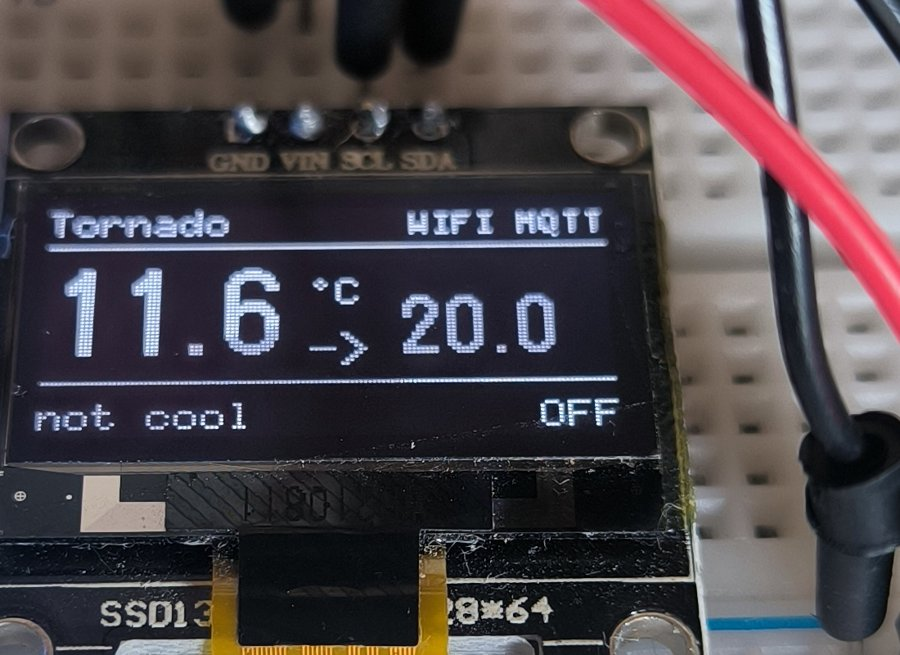
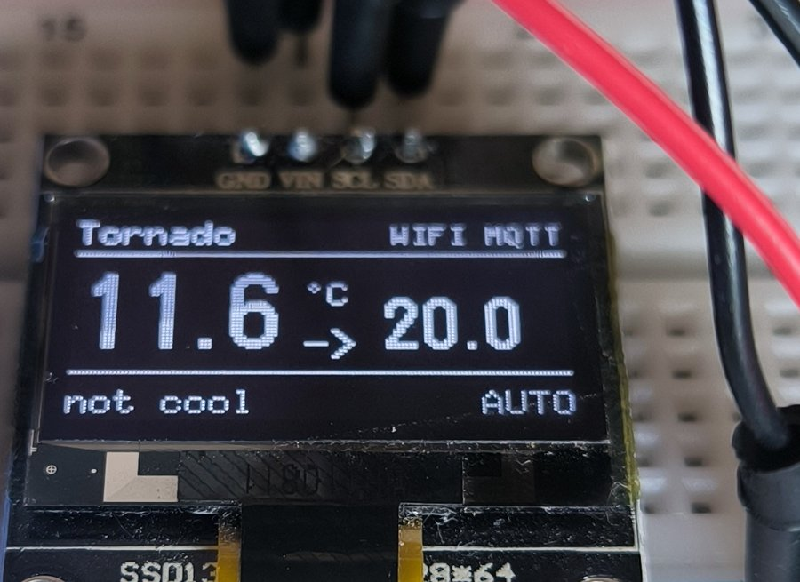
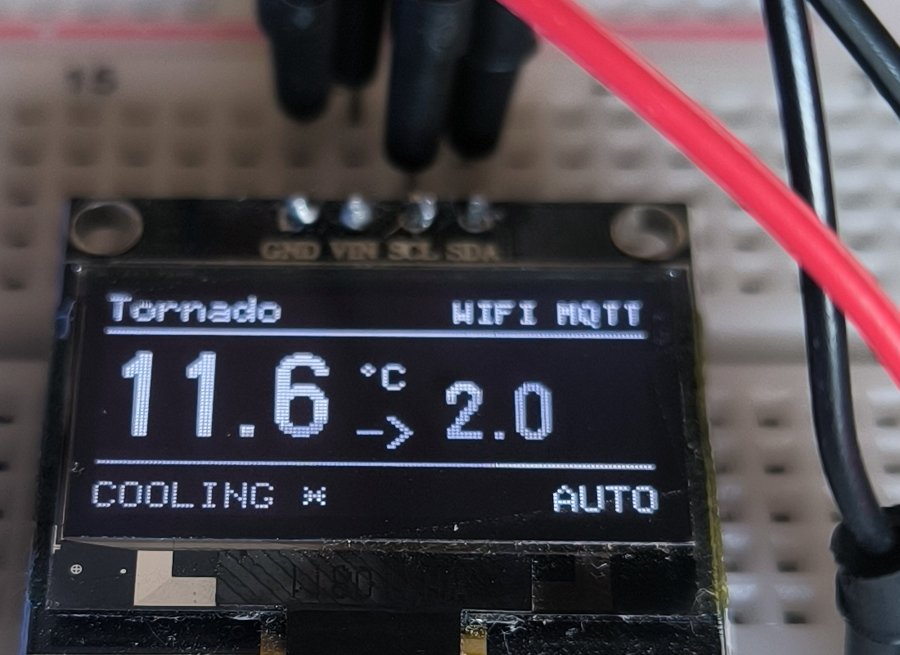
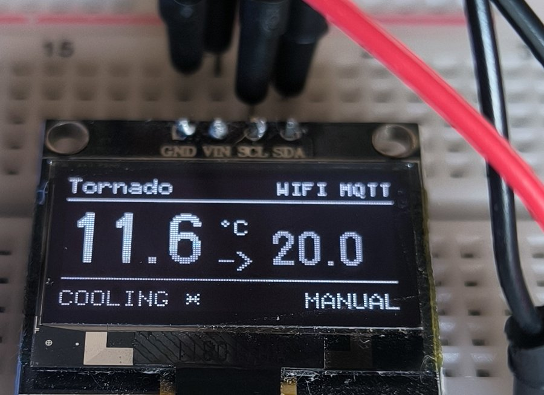

# cbpi-mqttdevice-ferment-display

[](https://www.gnu.org/licenses/gpl-3.0)


Wall-mounted display next to a fermenter, driven by [CraftBeerPi4](https://github.com/PiBrewing/craftbeerpi4) over MQTT. Shows current and target temperature, regulation mode, and live cooler/heater state.

**Phase 1 (current)** — read-only display on **Wemos D1 mini** (ESP8266) + **SSD1306 128×64 OLED**.
**Phase 2 (planned, hardware in transit)** — full UI on **ESP32 WROOM-32** + **ST7789V 2.0" TFT 240×320** + rotary encoder + buttons, with local setpoint and mode control.

---

## What it shows

Four real-world states the display surfaces, photographed from a working Wemos D1 mini + SSD1306 setup:

| State | Photo | Meaning |
|---|---|---|
| **OFF** |  | Fermenter not regulating. Cooler relay off. Nothing's happening — explicitly. |
| **AUTO idle** |  | CBPi regulates. Current T° is at or below target, so the cooler stays off. The system is "armed but quiet". |
| **AUTO cooling** |  | CBPi regulates. Current T° is above target (here: target dropped to 2.0°C for demo) — cooler is energized, hysteresis loop active. |
| **MANUAL** |  | Fermenter regulation is OFF, but a relay is energized anyway — meaning someone forced it on via the CBPi UI actor controls, bypassing the fermenter logic. Surfaced explicitly so operators don't assume "OFF means nothing's running". |

### Layout breakdown

```
+--------------------------------+
| Tornado          WIFI MQTT     |  fermenter name (top-left)
|                                |  connectivity status (top-right):
|                                |    WIFI  = associated to AP, got IP
|                                |    MQTT  = connected to broker, subscribed
|--------------------------------|
|                                |
|   11.6   °C   ->   20.0        |  current temp -> target temp
|                                |  (-- shown if value not yet known)
|                                |
|--------------------------------|
|  not cool             AUTO     |  cooler/heater state · regulation mode
+--------------------------------+
```

**Bottom-right status field** is computed live from CBPi4 state:
- **`AUTO`** — `fermenter.state == true` (CBPi regulating per hysteresis)
- **`MANUAL`** — `fermenter.state == false` but cooler or heater is energized (someone overrode)
- **`OFF`** — everything idle

**Cooler/heater label** uses verbose case to avoid misreading at a glance:
- `not cool` / `COOLING *` (relay off / on)
- `not heat` / `HEATING *` (when a heater is configured)

**Stale indicator**: a `!` to the right of the target temperature signals stale data (>90s with no update from CBPi4 — typically indicates the server or broker is down). The applicative watchdog will reboot the device automatically if this persists past 181 seconds.

The onboard blue LED gives status at a glance, **without needing to look at the screen or serial**:

| LED pattern | Meaning |
|---|---|
| Solid ON with brief dip every 2s | **READY** — WiFi + MQTT + subscribed, everything healthy |
| Double-blink slow | WiFi OK, MQTT down (check broker, credentials) |
| Fast symmetric blink | WiFi down (check SSID, password, signal) |
| Solid ON, no variation | Boot in progress, or `loop()` is stuck (bug) |
| Brief OFF flash overlay | An MQTT message just arrived (visual confirmation of live traffic) |

---

## Quick start

### Prerequisites

- A Linux machine for development (Windows/macOS work too, paths and udev rules differ)
- A Wemos D1 mini board (clones with CH340 or CP2102 USB-serial work)
- An SSD1306 I²C OLED (1.3" SH1106 works too — just swap the U8g2 constructor in `display.cpp`)
- A running CBPi4 instance with MQTT enabled, a fermenter configured, and a working MQTT broker (typically `mosquitto` on the same Pi as CBPi4)

### Install PlatformIO (one-time setup)

PlatformIO is a CLI-friendly build system for embedded targets. No IDE required.

```bash
pip install --user -U platformio
sudo usermod -a -G dialout $USER       # logout/login after this
```

### Build and flash

```bash
git clone https://github.com/daGrumpf-bxp/cbpi-mqttdevice-ferment-display.git
cd cbpi-mqttdevice-ferment-display

cp include/secrets.h.example include/secrets.h
vi include/secrets.h                   # fill in WiFi, MQTT broker, FERMENTER_ID

pio run -t upload                      # builds, then uploads to /dev/ttyUSB0 (auto-detected)
pio device monitor                     # 115200 bauds — Ctrl-T then Ctrl-X to exit
```

Find your `FERMENTER_ID` by sniffing the broker:

```bash
mosquitto_sub -h <broker> -v -t 'cbpi/fermenterupdate/#'
# Toggle a fermenter in CBPi4 UI — the topic contains the ID.
```

### Wiring (D1 mini + SSD1306)

| OLED | D1 mini |
|---|---|
| GND | GND |
| VCC | 3V3 |
| SDA | D2 (GPIO 4) |
| SCL | D1 (GPIO 5) |

Pin assignments are in `include/config.h` — edit there if you need different pins (e.g. on a board where D1/D2 are already used for relays).

---

## How it works

A high-level overview is in [ARCHITECTURE.md](ARCHITECTURE.md). In short:

- The device subscribes to `cbpi/fermenterupdate/<your_fermenter_id>`. From that payload, it discovers the IDs of the configured sensor, cooler, and heater.
- It subscribes dynamically to `cbpi/sensordata/<sensor_id>` for live temperature, and to `cbpi/actorupdate/<cooler_id>` briefly to discover the **raw MQTT topic** that drives the relay (`actor/4RB01/R01` or similar).
- Once the raw topic is known, it switches to listening there — that's the real-time, accurate source of cooler state. `actorupdate` itself has stale retained values and isn't trustworthy for live state. See [ARCHITECTURE.md → Decision: raw actor topic](ARCHITECTURE.md#decision-use-the-raw-actor-topic-not-cbpiactorupdate) for the gory details.
- If CBPi4 reassigns the sensor or relay in its UI, the next `fermenterupdate` triggers a re-subscription. No reflash needed.

The entire firmware is non-blocking (no `delay()`, no `while(!connected)`), event-driven, and survives WiFi/MQTT outages cleanly.

An applicative watchdog reboots the device if no fresh MQTT data is received for 181 seconds (= 3 × CBPi4 heartbeat + 1s margin), and performs a preventive reboot every day at 04:00 local time (NTP-synced) to clear any slow memory leaks. Both reboot causes are published on MQTT before restarting, so observers can distinguish a planned restart from a crash. See [External monitoring](#external-monitoring-home-assistant-node-red-etc) below.

---

## External monitoring (Home Assistant, Node-RED, etc.)

The firmware publishes its own state via MQTT, so anything that can speak MQTT can monitor it.

| Topic | Retained | Payload format | When published |
|---|---|---|---|
| `display/<DEVICE_NAME>/status` | yes | `{"value":"online","ts":"UTC 2026-05-18T14:32:11Z"}` | After every successful MQTT connect |
| `display/<DEVICE_NAME>/status` | yes | `{"value":"rebooting","ts":"UTC ..."}` | Before a planned reboot (data-stale or daily) |
| `display/<DEVICE_NAME>/status` | yes | `{"value":"offline","ts":"unknown, set by broker LWT"}` | Auto-published by the broker (LWT) on TCP drop = crash |
| `display/<DEVICE_NAME>/last_reboot_reason` | yes | `{"value":"data_stale","ts":"UTC ..."}` or `{"value":"daily","ts":"UTC ..."}` | Right before a planned reboot |

### Payload format notes

The `ts` field is **always self-describing**:
- **Sync OK**: `"UTC 2026-05-18T14:32:11Z"` — explicit `UTC ` prefix so it's obvious during debug. ISO 8601 format with Zulu suffix for tools that parse it.
- **No NTP sync yet**: `"no NTP sync, uptime=12345ms"` — uptime in milliseconds as fallback. Self-documenting so you immediately know why the field looks weird.
- **Offline (LWT)**: `"unknown, set by broker LWT"` — the LWT payload is registered statically with the broker at connect time, so we can't know in advance when (or whether) it will be published. Observers should use their own reception timestamp for offline events.

To check device state from a shell:

```bash
mosquitto_sub -h <broker> -v -t 'display/+/status' -t 'display/+/last_reboot_reason' --retained-only
```

Output example, healthy device:
```
display/ferm-tornado/status               {"value":"online","ts":"UTC 2026-05-18T14:32:11Z"}
display/ferm-tornado/last_reboot_reason   {"value":"daily","ts":"UTC 2026-05-18T04:00:01Z"}
```

Output, device crashed:
```
display/ferm-tornado/status               {"value":"offline","ts":"unknown, set by broker LWT"}
```

This makes it trivial to integrate later with notification systems (Telegram via Node-RED, Home Assistant alerts, etc.) without firmware changes.

---

## Closed-LAN / no-internet deployments

The firmware was designed to work in fully isolated networks (industrial brewery LAN with no internet access, customer site behind a strict firewall, etc.). Nothing requires reaching the public Internet:

| Function | Internet required? | What happens if blocked |
|---|---|---|
| WiFi association | No | Connects to local AP |
| MQTT to broker | No | Connects to local IP defined in `secrets.h` |
| CBPi4 traffic | No | Talks only to the local broker |
| OTA updates | No | Not implemented in Phase 1 |
| **NTP sync** | **Optionally** | **Daily reboot feature disabled, rest unaffected** |

The only feature affected by lack of internet is the watchdog's daily preventive reboot, which needs wall-clock time. If NTP can't sync (no route to public NTP servers), the firmware:

- Continues running normally
- Logs a one-time warning: `[wdt] WARNING: NTP not synced after 60000 ms uptime — daily reboot disabled until sync`
- Keeps the data-stale watchdog (the more important one) running unchanged

If the customer has a local NTP server (typical on industrial networks — router, PDC, dedicated time server), point at it in `secrets.h`:

```c
#define NTP_SERVER_1   "192.168.1.1"     // your router or local time server
#define NTP_SERVER_2   "192.168.1.2"
```

Or disable the daily reboot entirely if NTP is unavailable and you want clean serial logs:

```c
#define WDT_DAILY_REBOOT_ENABLED 0
```

A device running months on end without the daily reboot is fine in practice — the daily reboot is belt-and-suspenders insurance against slow leaks, not a fundamental requirement.

---

## Project layout

```
.
├── platformio.ini          PlatformIO build config (pinned lib versions)
├── README.md               (this file)
├── ARCHITECTURE.md         technical doc — read this before contributing
├── CHANGELOG.md            release history
├── LICENSE                 GPL-3.0
├── include/
│   ├── config.h            compile-time tunables (pins, timeouts, topics)
│   └── secrets.h.example   credentials template (real one is gitignored)
├── src/
│   ├── main.cpp            orchestration
│   ├── state.{h,cpp}       single source of truth (POD struct)
│   ├── cbpi_proto.{h,cpp}  CBPi4 JSON parsers (host-testable)
│   ├── net_wifi.{h,cpp}    non-blocking WiFi with event handlers
│   ├── net_mqtt.{h,cpp}    async MQTT with dynamic subscription tracking
│   ├── display.{h,cpp}     OLED rendering via U8g2
│   ├── heartbeat.{h,cpp}   LED status patterns + activity pulses
│   └── watchdog.{h,cpp}    "let it crash" applicative watchdog + LWT
└── test/
    ├── Makefile            `make test` to run host-side parser tests
    ├── test_main.cpp       29 unit tests against real CBPi4 payloads
    ├── Arduino.{h,cpp}     minimal Arduino stub for host build
    └── README.md
docs/
└── images/                  README screenshots (real OLED photos)
```

---

## Troubleshooting

### LED is blinking fast and symmetric

WiFi can't associate. Check `WIFI_SSID` and `WIFI_PASS` in `include/secrets.h`. Open `pio device monitor` to see the disconnect reason code:

| Reason | Cause | Fix |
|---|---|---|
| 202 (AUTH_FAIL) | Wrong password | Check `WIFI_PASS` |
| 201 (NO_AP_FOUND) | SSID not visible | Check `WIFI_SSID`, signal range |
| 200 (BEACON_TIMEOUT) | Signal dropping | Move closer, check AP load |

### LED is double-blink slow

WiFi works, MQTT broker rejects the connection. Open the monitor and read the reason code:

| Reason | Cause | Fix |
|---|---|---|
| 5 (NOT_AUTHORIZED) | Bad MQTT credentials | Set `MQTT_USER`/`MQTT_PASS` in `secrets.h` to match your broker config |
| 0 (TCP_DISCONNECTED) | Broker unreachable | Check `MQTT_HOST`/`MQTT_PORT`, network route, broker is running |
| 2 (IDENTIFIER_REJECTED) | Duplicate client ID | Make sure `DEVICE_NAME` is unique across all your boards |

### Upload fails: "Failed to connect to ESP8266" or "Timed out waiting for packet header"

Common causes on Linux:

1. **udev rules not installed** — PlatformIO will warn about this. Install:
   ```bash
   curl -fsSL https://raw.githubusercontent.com/platformio/platformio-core/develop/platformio/assets/system/99-platformio-udev.rules | sudo tee /etc/udev/rules.d/99-platformio-udev.rules
   sudo udevadm control --reload-rules && sudo udevadm trigger
   ```
2. **ModemManager hogging the port** — disable it if you're not using cellular modems:
   ```bash
   sudo systemctl stop ModemManager && sudo systemctl disable ModemManager
   ```
3. **Cheap clone needs slower baud** — drop `upload_speed` in `platformio.ini` from `921600` to `115200`.
4. **D1 mini's onboard USB is dead** — surprisingly common on used boards. Use an external USB-TTL adapter, wire `TX/RX/D3(GPIO0)/GND/5V`, and either hold reset during upload or use the "open minicom → press RESET → close minicom → flash" trick to put the chip in bootloader mode.

### "Cooler shows ON but UI says OFF"

This was a real bug we hit during development. Resolved in v0.4 by listening to the raw actor topic instead of `cbpi/actorupdate/`. See [ARCHITECTURE.md → CBPi4 gotcha](ARCHITECTURE.md#gotcha-cbpiactorupdate-has-stale-retained-values). If you see this again, the symptom likely isn't the firmware but stale retained values on a topic somewhere — sniff with `mosquitto_sub --retained-only -t '#'` to see what's lurking.

### State shows `stale=1` permanently

Means no `fermenterupdate` or `sensordata` arrived in the last 90s. Check:
- `mosquitto_sub -h <broker> -t 'cbpi/fermenterupdate/<your_id>'` — should produce a message at least every 60s
- CBPi4 is running, MQTT is enabled (`mqtt: True` in `config.yaml`)
- Broker is healthy: `systemctl status mosquitto`

### OLED screen blank / `[disp] no I2C ACK at 0x3C`

The firmware probes the I²C bus at boot and retries every 5s. If you see `no I2C ACK at 0x3C (err=N) — wiring/power?` repeating in serial:

| err | Meaning | Most likely cause |
|---:|---|---|
| 1 | data too long for transmit buffer | Library/code bug — shouldn't happen for a zero-byte probe |
| 2 | NACK on transmit of address | OLED not responding — wrong address (try 0x3D), or wiring fault |
| 3 | NACK on transmit of data | Wiring intermittent, capacitive interference |
| 4 | other error | Bus held low — short, wrong pin, dead chip |

Diagnostic steps in order:
1. **Check the address jumper on the back of the OLED** — some modules ship as 0x3D. Update `OLED_I2C_ADDR` in `include/config.h`.
2. **Reseat the dupont wires** — particularly SDA/SCL. Dupont contacts loosen over time, especially after a few months of bench use.
3. **Check VCC is on 3V3, not 5V** — some OLED modules don't tolerate 5V on their logic side.
4. **Add a 100 µF capacitor between VCC and GND of the OLED** — the SSD1306 controller is sensitive to brown-outs during WiFi TX bursts on the D1 mini.
5. **Try lowering the I²C clock** in `config.h`: `#define I2C_CLOCK_HZ 50000UL` (50 kHz). Helps with long or noisy cables.
6. **Swap the OLED** with a known-good unit if you have one. The hot-plug retry means you can plug a new OLED in while the device runs and you'll see `[disp] OLED recovered after retry` once it's detected.

### Tests fail locally

```bash
cd test && make clean && make test
```

If a test fails, your local CBPi4 might emit a slightly different payload than what's pinned. Open `test/test_main.cpp` and adjust the `PAYLOAD_*` constants to match what your `mosquitto_sub` dump shows. If it's a real CBPi4 quirk, open an issue with the dump so we can update the upstream tests.

---

## Roadmap

### Phase 1 — D1 mini + OLED (current)

- [x] Non-blocking WiFi (event-driven, `WiFi.onEvent*`)
- [x] Async MQTT (AsyncMqttClient, dynamic subscription tracking)
- [x] CBPi4 fermenter / sensor / raw actor parsing
- [x] Onboard LED status patterns
- [x] SSD1306 128×64 rendering via U8g2
- [x] Host-side unit tests (29 cases against real CBPi4 payloads)
- [x] OLED hot-plug detection (I²C ACK probe + retry every 5s)
- [x] Applicative watchdog (data-stale + daily wall-clock reboot)
- [x] NTP sync (France TZ with DST)
- [x] MQTT LWT (online / rebooting / offline) for external observability
- [x] Field test on real fermenter (Tornado) — 4 states validated (OFF, AUTO idle, AUTO cooling, MANUAL)
- [ ] Field test over multiple days (long-term stability)
- [ ] 3D-printed enclosure (front plate STL)

### Phase 2 — ESP32 + TFT + encoder

- [ ] Port to ESP32 WROOM-32 (`[env:esp32]` in `platformio.ini`)
- [ ] TFT 2.0" 240×320 rendering (TFT_eSPI or LovyanGFX)
- [ ] KY-040 rotary encoder: adjust setpoint ±0.5°C
- [ ] MODE button: toggle AUTO/OFF
- [ ] BACK button: navigation
- [ ] Publish `cbpi/updatefermenter` with new payload to control CBPi
- [ ] Multi-fermenter dashboard (optional, if useful in practice)

See [ARCHITECTURE.md → Phase 2 plan](ARCHITECTURE.md#phase-1-vs-phase-2-plan) for the technical breakdown.

---

## Contributing

Issues and pull requests welcome. A few conventions:

- Run the host-side tests before opening a PR: `cd test && make test` (29 tests must pass).
- Keep modules single-purpose. The clean separation between parsing (`cbpi_proto`), state (`state`), network (`net_wifi`/`net_mqtt`), and rendering (`display`) is what makes the Phase 1 → Phase 2 port realistic.
- If your change contradicts a design decision in [ARCHITECTURE.md](ARCHITECTURE.md), that's fine — but update the doc to reflect the new rationale.
- Code style: 4-space indent, `snake_case` for functions and variables, `PascalCase` for types and enums, namespaces over class hierarchies.
- Commit messages and code comments in English. Issue discussions can be in French or English.

For bug reports, please include:
- Hardware (D1 mini clone, OLED model)
- CBPi4 version (`pip show cbpi`)
- Serial log output during the problematic behaviour
- LED pattern observed
- Output of `mosquitto_sub --retained-only -t '#'` if relevant

---

## Acknowledgements and prior art

- **[PiBrewing/craftbeerpi4](https://github.com/PiBrewing/craftbeerpi4)** — the brewing controller this device complements. Without CBPi4 there's nothing to display.
- **[InnuendoPi/MQTTDevice4](https://github.com/InnuendoPi/MQTTDevice4)** — the inspiration for the CBPi4 MQTT protocol layer. We initially considered forking but went from-scratch (see [ARCHITECTURE.md](ARCHITECTURE.md)). The topic naming conventions and payload formats were verified by reverse-engineering an MQTTDevice4 firmware binary.
- **[marvinroger/async-mqtt-client](https://github.com/marvinroger/async-mqtt-client)** — the non-blocking MQTT library that makes the whole thing reliable.
- **[olikraus/U8g2](https://github.com/olikraus/U8g2)** — pixel-perfect monochrome graphics with a sensible API.

---

## License

GPL-3.0-or-later — see [LICENSE](LICENSE).

Choice of GPL-3.0 is for consistency with the CBPi4 ecosystem (MQTTDevice4 and CBPi4 itself are GPL-licensed).
